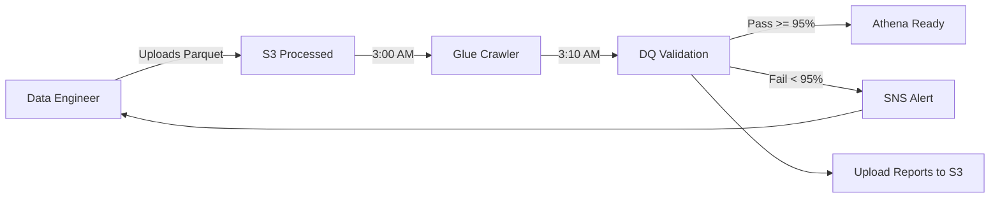

# Data Quality Rules - Emergency Vehicles Digital Twin

**Project**: Emergency Vehicles Digital Twin  
**Role**: Data Quality Engineer  
**Dataset**: Emergency vehicle telemetry, events, and incidents

---

## Rule Overview

| Rule ID | Rule Name | Severity | Tables |
|---------|-----------|----------|--------|
| DQ-01 | Primary Key Uniqueness | CRITICAL | All |
| DQ-02 | Foreign Key Integrity | CRITICAL | telemetry_readings, events, anomalies |
| DQ-03 | Enum Value Validity | HIGH | vehicles, events, anomalies, incidents, telemetry |
| DQ-04 | Telemetry Value Ranges | CRITICAL | telemetry_readings |
| DQ-05 | Timestamp Validity | HIGH | All time-series tables |
| DQ-06 | Required Field Completeness | CRITICAL | All |
| DQ-07 | Risk Score Range | CRITICAL | vehicles |
| DQ-08 | Event Sequence Logic | MEDIUM | events |
| DQ-09 | Geospatial Validity | HIGH | vehicles, telemetry_readings, incidents |

---

## Rule Definitions

### DQ-01: Primary Key Uniqueness
**Severity**: CRITICAL  
**Tables**: vehicles, telemetry_readings, events, anomalies, incidents

**Definition**: Every record must have a unique identifier with no duplicates.

**Business Justification**:
- Duplicate IDs break referential integrity across the Digital Twin system
- Emergency dispatch requires unique vehicle identification
- Analytics queries depend on accurate counting and aggregation
- Historical tracking becomes impossible with duplicate keys

**Validation Logic**:
```python
# Count unique IDs vs total rows
duplicates = total_rows - unique_ids
passed = duplicates == 0
```

**Remediation**: Remove duplicate rows, regenerate UUIDs for duplicates

---

### DQ-02: Foreign Key Integrity
**Severity**: CRITICAL  
**Tables**: telemetry_readings, events, anomalies (→ vehicles)

**Definition**: All foreign keys must reference existing parent records.

**Business Justification**:
- Orphaned telemetry readings cannot be attributed to vehicles
- Events without valid vehicles break operational dashboards
- Anomaly detection requires valid vehicle context
- Real-time monitoring depends on accurate vehicle linkage

**Foreign Key Relationships**:
- `telemetry_readings.vehicle_id` → `vehicles.id`
- `events.vehicle_id` → `vehicles.id`
- `anomalies.vehicle_id` → `vehicles.id`
- `anomalies.telemetry_reading_id` → `telemetry_readings.id`

**Validation Logic**:
```python
# Check FKs exist in parent table
orphaned = child_fks not in parent_pks
passed = len(orphaned) == 0
```

**Remediation**: Delete orphaned records or restore missing parent records

---

### DQ-03: Enum Value Validity
**Severity**: HIGH  
**Tables**: vehicles, events, anomalies, incidents, telemetry_readings

**Definition**: Categorical columns must only contain predefined allowed values.

**Business Justification**:
- Vehicle type determines dispatch priority (police vs ambulance)
- Event types trigger different workflows in dispatch system
- Severity levels control alerting thresholds
- Invalid enums break filtering and reporting dashboards

**Allowed Values**:
- `vehicle.type`: police, ambulance, fire_truck, civil_protection, hybrid
- `vehicle.status`: available, in_service, en_route, at_scene, maintenance, offline
- `event.event_type`: dispatch, en_route, arrived, completed, maintenance_alert, refuel
- `severity`: info, warning, critical
- `metric_type`: speed, engine_temp, fuel_level, tire_pressure, battery_voltage, rpm, oil_pressure, odometer

**Validation Logic**:
```python
# Check values against whitelist
invalid = values not in allowed_values
passed = len(invalid) == 0
```

**Remediation**: Standardize values, map variations to canonical enums

---

### DQ-04: Telemetry Value Ranges
**Severity**: CRITICAL  
**Tables**: telemetry_readings

**Definition**: Sensor readings must fall within physically possible ranges.

**Business Justification**:
- Out-of-range values indicate sensor malfunction
- Impossible readings (e.g., 500°C engine temp) trigger false alarms
- Anomaly detection relies on valid baseline measurements
- Predictive maintenance models fail with corrupt sensor data

**Telemetry Ranges** (from Digital Twin specification):
| Metric | Min | Max | Unit | Justification |
|--------|-----|-----|------|---------------|
| speed | 0 | 160 | km/h | Emergency vehicle max speed |
| engine_temp | 70 | 120 | °C | Normal operating temperature |
| fuel_level | 5 | 100 | % | Reserve to full tank |
| tire_pressure | 28 | 40 | PSI | Recommended pressure range |
| battery_voltage | 11.5 | 14.8 | V | 12V system normal range |
| rpm | 600 | 7000 | RPM | Idle to max RPM |
| oil_pressure | 20 | 80 | PSI | Automotive engine range |
| odometer | 0 | 999999 | km | Before rollover |

**Validation Logic**:
```python
# Check value within bounds for each metric type
out_of_range = (value < min) | (value > max)
passed = len(out_of_range) == 0
```

**Remediation**: Flag sensor for recalibration, interpolate from nearby readings

---

### DQ-05: Timestamp Validity
**Severity**: HIGH  
**Tables**: All time-series tables

**Definition**: Timestamps must be >= system deployment date and not far in the future.

**Business Justification**:
- Timestamps before 2020 are impossible (system launched 2020-01-01)
- Future timestamps break time-series analytics and event ordering
- Historical queries depend on accurate temporal data
- Real-time dashboards malfunction with future-dated events

**Temporal Bounds**:
- Minimum: 2020-01-01 (Digital Twin deployment date)
- Maximum: Now + 1 hour (tolerance for clock skew)

**Validation Logic**:
```python
# Check timestamps within valid range
too_old = timestamp < system_start_date
too_new = timestamp > (now + 1 hour)
passed = len(too_old) == 0 and len(too_new) == 0
```

**Remediation**: Correct system clocks, re-import data with correct timestamps

---

### DQ-06: Required Field Completeness
**Severity**: CRITICAL  
**Tables**: All

**Definition**: Mission-critical fields must not have NULL values.

**Business Justification**:
- NULL vehicle IDs break dispatch assignment
- Missing timestamps prevent event ordering
- NULL severity levels disable alerting rules
- Core fields drive operational decisions

**Required Fields by Table**:
- `vehicles`: id, type, name, plate_number, status
- `telemetry_readings`: id, vehicle_id, metric_type, value, timestamp
- `events`: id, vehicle_id, event_type, timestamp
- `anomalies`: id, vehicle_id, severity, status, timestamp
- `incidents`: id, incident_type, severity, latitude, longitude

**Validation Logic**:
```python
# Check for NULL values in required fields
null_count = field.isna().sum()
passed = null_count == 0
```

**Remediation**: Populate from upstream systems, use default values where appropriate

---

### DQ-07: Risk Score Range
**Severity**: CRITICAL  
**Tables**: vehicles

**Definition**: Vehicle risk scores must be between 0 and 100.

**Business Justification**:
- Risk scores drive preventive maintenance scheduling
- Out-of-range scores break priority algorithms
- Dashboard visualizations expect 0-100 scale
- Predictive models trained on normalized risk scores

**Valid Range**: [0, 100]

**Validation Logic**:
```python
# Check risk_score within bounds
out_of_range = (risk_score < 0) | (risk_score > 100)
passed = len(out_of_range) == 0
```

**Remediation**: Recalculate risk score from anomaly aggregation

---

### DQ-08: Event Sequence Logic
**Severity**: MEDIUM  
**Tables**: events

**Definition**: Events for the same vehicle should follow chronological order.

**Business Justification**:
- Out-of-order events indicate clock synchronization issues
- Timeline visualizations require monotonic timestamps
- Event causality analysis depends on correct ordering
- Dispatch workflow assumes logical event progression

**Validation Logic**:
```python
# Check timestamps are monotonically increasing per vehicle
for vehicle_id in vehicles:
    events_sorted = events.sort_values('timestamp')
    violations = not events_sorted.timestamp.is_monotonic_increasing
```

**Remediation**: Re-sort events, investigate clock drift on vehicle devices

---

### DQ-09: Geospatial Validity
**Severity**: HIGH  
**Tables**: vehicles, telemetry_readings, incidents

**Definition**: GPS coordinates must be within the Madrid operational area.

**Business Justification**:
- Coordinates outside Madrid indicate GPS malfunction
- Map rendering breaks with invalid coordinates
- Proximity calculations fail with out-of-bounds data
- Geofencing rules depend on accurate locations

**Geographic Bounds** (Madrid metropolitan area):
- Latitude: [40.3, 40.6]
- Longitude: [-3.9, -3.5]

**Validation Logic**:
```python
# Check coordinates within Madrid bounding box
out_of_bounds = (lat < 40.3) | (lat > 40.6) | (lon < -3.9) | (lon > -3.5)
passed = len(out_of_bounds) == 0
```

**Remediation**: Flag GPS sensor for recalibration, use last known good location

---

## Severity Definitions

| Severity | Impact | Response |
|----------|--------|----------|
| CRITICAL | Data unusable, system breaks | Block pipeline, immediate fix |
| HIGH | Analytics degraded, wrong results | Alert engineer, fix within 24h |
| MEDIUM | Minor inconsistencies, edge cases | Log warning, fix in next cycle |

---

## Execution Results

See `data_quality/logs/validation_report_YYYYMMDD_HHMMSS.json` for detailed results.

**Latest Run**: 2026-05-17 14:05:40  
**Pass Rate**: 98.36% (60/61 checks passed)

---

## Data Source Strategy

### Primary Source: S3 Parquet Files

**Location**: `s3://emergency-vehicles-processed/processed/`  
**Format**: Parquet with Snappy compression  
**Partitioning**: `year=YYYY/month=MM/day=DD/data.parquet`

### Validation Workflow
```
┌─────────────────────────────────────────────────────────────┐
│ 1. Data Engineer uploads Parquet to S3 processed zone      │
│    ↓                                                        │
│ 2. Data Quality reads Parquet directly from S3             │
│    ↓                                                        │
│ 3. Execute 9 validation rules (61 checks)                  │
│    ↓                                                        │
│ 4. Generate JSON report → S3                               │
│    ↓                                                        │
│ 5. Generate HTML report → S3                               │
│    ↓                                                        │
│ 6. Evaluate pass rate:                                     │
│    • >= 95%: APPROVE batch, enable for Athena queries      │
│    • < 95%:  REJECT batch, alert Data Engineer             │
└─────────────────────────────────────────────────────────────┘
```

### Why Validate S3 Parquet (Not Local CSV)?

| Reason | Explanation |
|--------|-------------|
| **Post-Transformation Integrity** | Validates data AFTER CSV → Parquet conversion |
| **Detects Corruption** | Catches issues introduced during S3 upload |
| **Production Parity** | Validates exact data Athena will query |
| **Compression Validation** | Ensures Snappy compression didn't corrupt data |
| **Schema Enforcement** | Confirms Parquet schema matches expectations |

### Execution Schedule

**Automated via AWS EventBridge**:
- **Trigger**: Daily at 3:10 AM (10 minutes after Glue Crawler finishes)
- **Action**: Lambda invokes `validate.py`
- **Output**: Reports uploaded to `s3://emergency-vehicles-reports/data-quality/`

**Manual Execution** (for development):
```bash
python data_quality/validate.py
```

---

## Report Storage

### JSON Report
**Path**: `s3://emergency-vehicles-reports/data-quality/json/validation_report_YYYYMMDD_HHMMSS.json`  
**Purpose**: Machine-readable for alerting/monitoring systems  
**Retention**: 90 days

### HTML Report
**Path**: `s3://emergency-vehicles-reports/data-quality/html/validation_report_YYYYMMDD_HHMMSS.html`  
**Purpose**: Human-readable for engineers and stakeholders  
**Retention**: 30 days  
**Access**: Publicly accessible via S3 static website hosting

---

## Alerting Rules

| Condition | Action |
|-----------|--------|
| Pass rate < 95% | Send SNS alert to data-engineering-team |
| Critical rule fails (DQ-01, DQ-02, DQ-04, DQ-06, DQ-07) | Immediately block downstream processing |
| High rule fails (DQ-03, DQ-05, DQ-09) | Log warning, continue processing |
| Medium rule fails (DQ-08) | Log info, continue processing |

---

## Integration with Data Pipeline



---

## Future Enhancements

1. **Great Expectations Integration**: Migrate to Great Expectations framework for profiling
2. **Streaming Validation**: Real-time validation on Kinesis streams
3. **ML-based Anomaly Detection**: Supplement rule-based with statistical models
4. **Data Lineage Tracking**: Integrate with Apache Atlas for impact analysis