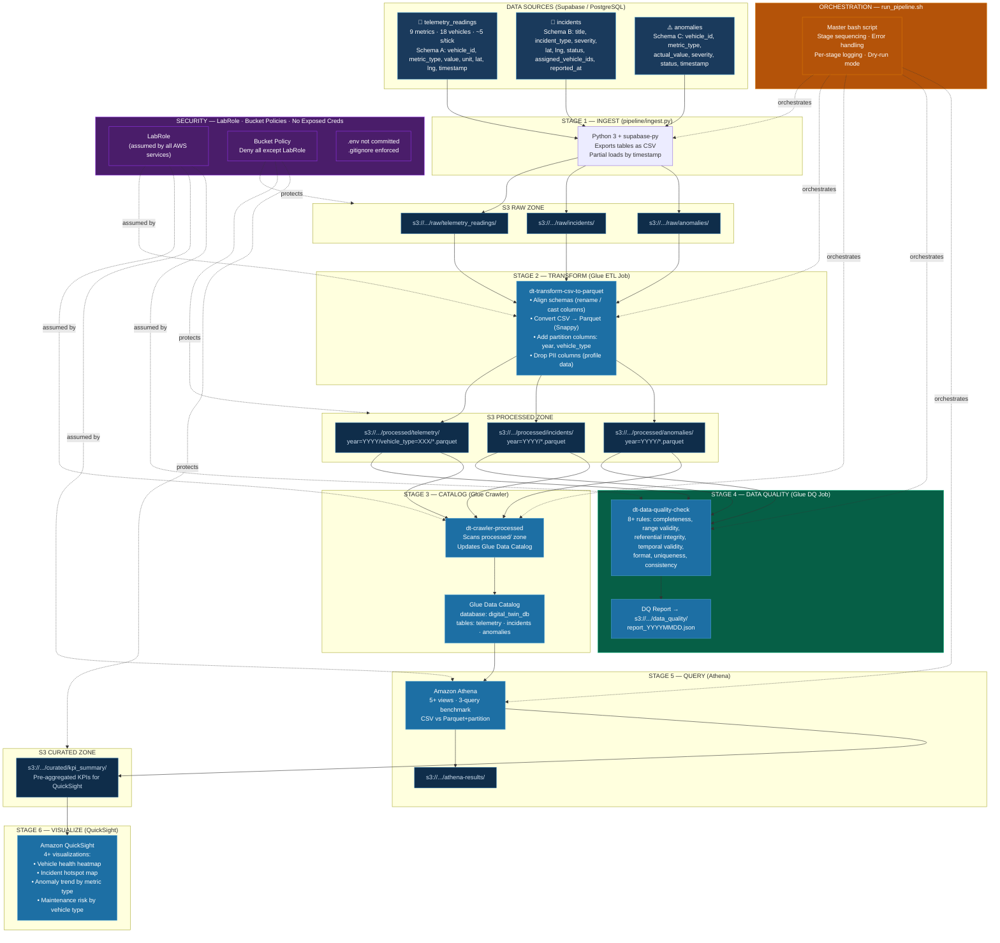
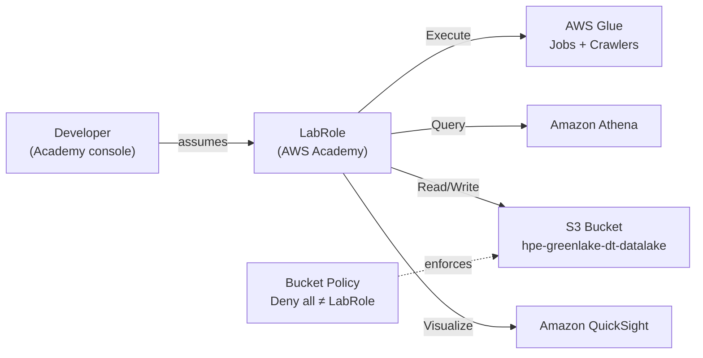

# Architecture Diagram

**Role 4 — Orchestration & Operations Engineer**
HPE GreenLake Digital Twin | Data Engineering Capstone

> This file contains the Mermaid source for the architecture diagram.
> To export as PNG: paste the code block into [mermaid.live](https://mermaid.live) → Download PNG → save as `architecture.png` in this folder.

---

## Full Pipeline Architecture

---

## IAM / Access Control Layer

---

## Error Handling per Stage

| Stage | Failure condition | `run_pipeline.sh` response |
|-------|------------------|---------------------------|
| 1 — Ingest | No files in S3 after export | `die()` — pipeline stops, error logged |
| 2 — Transform | Glue job `FAILED` / `TIMEOUT` | `die()` with Glue error message |
| 3 — Catalog | Crawler stuck / not found | `die()` if not found; `warn()` if non-SUCCEEDED status |
| 4 — Quality | DQ job fails OR rules fail | `die()` — blocks downstream stages |
| 5 — Athena | Individual view fails | `warn()` — pipeline continues, failure noted in log |

All stages write timestamped entries to `orchestration/logs/pipeline_run_<ts>.log`.
